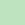

# IPFS org issue labeling standards

**NOTE: These will eventually want to live in a public repo for all to see and use. Their current location in `ipfs-dev-exp` is temporary while we talk through the [issue of a global labeling strategy for IPFS](https://github.com/protocol/ipfs-dev-exp/issues/3).**

As of Q2 2020, the IPFS org standardizes on the following default core labels for GitHub issues and pull requests. This ensures continuity
between repos, helping to improve the overall experience for contributors as a whole while also making it easier to use project
planning tools (such as ZenHub) to create landscape-level views across multiple repos.

When creating a net-new repo, or renaming your existing repo's labels, please adhere to the standard labels below. **At minimum, include in your set of available labels the ones marked as mandatory below (Global, Priority, Kind, Need). All new issues in your repo should also be triaged with at least those four labels.** However, it is strongly encouraged to build all of the below labels into your repo's core label "library", and use them on an ongoing basis to keep track of your issues as a whole.

It is understood that each repo may have its own needs that demand the use of additional labels. In this case, it's recommended to extend a particular repo's taxonomy along the lines of similar, complex repos within the IPFS org or Protocol Labs as a whole; one particularly thorough example of this is the [labeling taxonomy used by libp2p](https://github.com/libp2p/libp2p/blob/master/ISSUE-LABELLING.md). Before creating a new label, check to see if others in IPFS or PL have already solved your problem with something that already exists.

Finally, it is strongly suggested that all repos use issue templates, each with a default of all new issues being labeled `need/triage`. This greatly facilitates speed to triage overall.

***Note:** Common GitHub tools may also assign their own automatic labels using taxonomy outside of this set. It is recommended that these labels be retained in order to keep the tools working, but that the labels NOT be used for any other purposes. Examples of this include Dependabot's `security` and `dependencies` labels, and ZenHub's `epic` label.*

## Mandatory labels

### Global
These are exceptions to the remainder of this labeling taxonomy, but exist for continuity with global GitHub practices for new contributors.

| Label | Description | Color |
| ----- | ----------- | ----- |
| `bounty` | Has bounty! See https://github.com/ipfs/devgrants/projects/1 |  `#1cfc60` |
| `good first issue` | Good issue for new contributors |  `#7057ff` |
| `help wanted` | Seeking public contribution on this issue |  `#0e8a16` |

### Priority
Indicates priority as a function of standard PL-wide OKR priority rankings. **Important: P0 items need an assignee to act as a DRI.**

| Label | Description | Color |
| ----- | ----------- | ----- |
| `P0` | Critical: Tackled by core team ASAP |  `#b60205` |
| `P1` | High: Likely tackled by core team if no one steps up |  `#d93f0b` |
| `P2` | Medium: Good to have, but can wait until someone steps up |  `#e99695` |
| `P3` | Low: Not priority right now |  `#f9d0c4` |

### Kind
Overarching type of issue or PR. For an additional layer of specificity, use the `area` label.

| Label | Description | Color |
| ----- | ----------- | ----- |
| `kind/architecture` | Core architecture of project |  `#c7def8` |
| `kind/bug` | A bug in existing code (including security flaws) |  `#fc2929` |
| `kind/discussion` | Topical discussion; usually not changes to codebase |  `#c7def8` |
| `kind/enhancement` | A net-new feature or improvement to an existing feature |  `#c7def8` |
| `kind/maintenance` | Work required to avoid breaking changes or harm to project's status quo |  `#c7def8` |
| `kind/support` | A question or request for support |  `#c7def8` |
| `kind/test` | Testing work |  `#c7def8` |

### Need
These labels indicate needs that must be met in order for the issue or PR to be completed and closed. These will often appear in conjunction with `status/blocked` to add a layer of specificity to the latter. **Important: ALL new issues in a repo should default to `need/triage`, and this label should be removed once all other relevant labels are assigned.**

| Label | Description | Color |
| ----- | ----------- | ----- |
| `need/analysis` | Needs further analysis before proceeding |  `#ededed` |
| `need/author-input` | Needs input from the original author |  `#ededed` |
| `need/community-input` | Needs input from the wider community |  `#ededed` |
| `need/maintainer-input` | Needs input from the current maintainer(s) |  `#ededed` |
| `need/triage` | Needs initial labeling and prioritization |  `#ededed` |

## Optional (but helpful) labels

### Difficulty
Estimate of an issue's difficulty; note that this is different than `effort`, below.

| Label | Description | Color |
| ----- | ----------- | ----- |
| `dif/trivial` | Can be confidently tackled by newcomers |  `#bfe5bf` |
| `dif/easy` | Someone with a little familiarity can pick up |  `#bfe5bf` |
| `dif/medium` | Prior experience is likely helpful |  `#bfe5bf` |
| `dif/hard` | Having worked on the specific codebase is important |  `#bfe5bf` |
| `dif/expert` | Extensive knowledge (implications, ramifications) required |  `#bfe5bf` |

### Effort
Similar to T-shirt sizing, this estimates the *amount* of work. This can be different than `difficulty`, e.g. something can be easy but require a lot of time to complete, or vice versa.

| Label | Description | Color |
| ----- | ----------- | ----- |
| `effort/hours` | Estimated to take one or several hours |  `#fef2c0` |
| `effort/days` | Estimated to take multiple days, but less than a week |  `#fef2c0` |
| `effort/weeks` | Estimated to take multiple weeks |  `#fef2c0` |

### Status
Current status of the issue or PR. Note that it may be advantageous to add second-tier variants on `status/blocked` to your repo if there are common blocking scenarios, i.e. `status/blocked/upstream-bug`.

| Label | Description | Color |
| ----- | ----------- | ----- |
| `status/blocked` | Unable to be worked further until needs are met |  `#b52ed1` |
| `status/deferred` | Conscious decision to pause or backlog |  `#dcc8e0` |
| `status/inactive` | No significant work in the previous month |  `#dcc8e0` |
| `status/in-progress` | In progress |  `#dcc8e0` |
| `status/ready` | Ready to be worked |  `#dcc8e0` |
| `status/duplicate` | This issue or pull request already exists |  `#e9dfeb` |

### Topics
Topics will vary according to the particular project, but will often have commonalities that overlay across multiple projects. Design is one prominent example of this, particularly since the following design labels are used to generate a common design tracking board:

| Label | Description | Color |
| ----- | ----------- | ----- |
| `topic/design-content` | Content design, writing, information architecture |  `#3f4b56` |
| `topic/design-front-end` | Front-end implementation of UX/UI work |  `#3f4b56` |
| `topic/design-ux` | UX strategy, research, not solely visual design |  `#3f4b56` |
| `topic/design-video` | Video and/or motion design |  `#3f4b56` |
| `topic/design-visual` | Visual design ONLY, not part of a larger UX effort |  `#3f4b56` |

Other commonly encountered topics across multiple repos include:

| Label | Description | Color |
| ----- | ----------- | ----- |
| `topic/docs` | Documentation |  `#3f4b56` |
| `topic/infra` | Infrastructure |  `#3f4b56` |
| `topic/interop` | Interoperability |  `#3f4b56` |

### Area
Areas will vary depending on the needs of the particular repo, but refer to a commonly-encountered functional or abstraction layer for a project. They take the following form, where *foo* is a project-specific functional or abstraction layer, e.g. *firefox* or *libp2p*.

| Label | Description | Color |
| ----- | ----------- | ----- |
| `area/foo` | *Area-specific description to go here* |  `#ccf0ed` |
