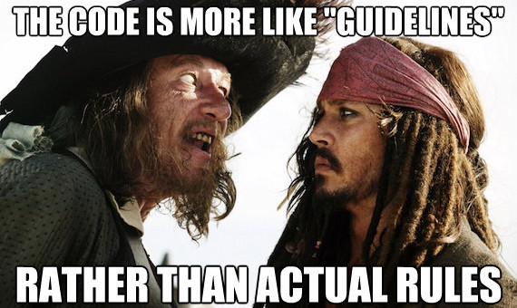

Guidelines for JavaScript projects
=================================

In any guidelines document, it is important to emphasize that these are mostly our shared consensus on protocol and etiquette from what we've built so far. Every single item that is presented here comes from a lot of experimentation. However, that doesn't mean that there isn't a better way. This is simply what we found to work best for us. In this document you will find notes about:

- Project structure.
- Code style.
- Continuous integration.
- Tests.
- Tasks (asset pipeline, transpiling, releasing, etc).
- Dependency management.

Our toolkit for each of these is not set in stone, and we don't plan to halt our constant search for better tools.

Remember:



### Table of Contents

- [Goals and Expectations](#goals-and-expectations)
- [The Guidelines](#the-guidelines)
    - [Linting & Code Style](#linting-&-code-style)
    - [Test](#test)
    - [Build](#build)
    - [Release](#release)
- [Dignified.js](#dignifiedjs)
    - [...for maintainers](#for-maintainers)
      - [Setting up `dignified.js`](#setting-up-dignifiedjs)
      - [Directory Structure](#directory-structure)
      - [Default `require`](#default-require)
      - [Continuous integration](#continuous-integration)
      - [`.gitignore`](#gitignore)
      - [Dependency management](#dependency-management)
      - [Pre-Commit](#pre-commit)
    - [...for consumers](#for-consumers)
- [FAQ](#faq)
  - [Why are you not using XYZ?](#why-are-you-not-using-xyz)
  - [Why not use simple npm scripts instead of gulp?](#why-not-use-simple-npm-scripts-instead-of-gulp)
  - [Where are all the semicolons?](#where-are-all-the-semicolons)
  - [Why are you bothering with ES2015 and all this build setup?](#why-are-you-bothering-with-es2015-and-all-this-build-setup)
  - [Do I have to use ES2015 and Babel?](#do-i-have-to-use-es2015-and-babel)
  - [Do I have to bundle everything with webpack?](#do-i-have-to-bundle-everything-with-webpack)
  - [Why are you doing this?](#why-are-you-doing-this)
- [Contributing](#contributing)
- [Code of Conduct](#code-of-conduct)
- [References - Resources and good reads](#references---resources-and-good-reads)
- [Acknowledgment](#acknowledgment)

## Goals and Expectations

For the majority of our JavaScript projects, our goals are:

- **Browser compatibility**, with the possible exceptions being:
  - Access to the file system.
  - Native bindings.
  - Network transports (uTP, udt, curveCP, etc) that are not available in the browser.
- **Don't break CommonJS's** `require`. This means that if someone requires a JavaScript module from the IPFS ecosystem, they should be able to require it and use browserify, webpack or other bundlers without having to worry about adding special shims for module internals.
- **Encourage Contribution**.
- **Great UX** for everyone involved.

## The Guidelines

#### Linting & Code Style

IPFS JavaScript projects default to [standard](https://github.com/feross/standard) code style. It is a great and clean codestyle and its adoption is increasing significantly, making the code that we write familiar to the majority of the developers.

However, we've added an extra linting rule: Enforce the use of [strict mode](https://developer.mozilla.org/en-US/docs/Web/JavaScript/Reference/Strict_mode). This avoids issues we had when using ES2015 features outside of strict mode. We enforce this rule by using [eslint](http://eslint.org/) and extending [standard module](https://github.com/feross/standard) with the [eslint-config-standard](https://github.com/feross/eslint-config-standard).

#### Test

Since `js-ipfs` is meant to be both a Node.js and Browser app, we strongly recommend having tests that run in both platforms, always. For most cases, we use [mocha](http://mochajs.org) to run write the tests and [karma](http://karma-runner.github.io) to automate the test execution in the browser. This solution has been extremely convenient.

#### Build

In most IPFS JavaScript projects, we use [webpack](http://webpack.github.io/) for bundling the JavaScript. It adds a greater overhead when it comes to configuration, but this configuration can be reused since most projects share the same needs.

Where ES2015 is used, we managed to ensure that the code continues to run in every platform by transpiling it, if necessary, with [babel](http://babeljs.io/).

To make sure users can use the modules without having to transpile and shim the modules themselves, we've made the following available in most modules:

- __Raw ES2015 version__, ready to be consumed by platforms that understand Node.js based require and most of ES2015.
- __Raw ES5 version__, ready to be consumed by platforms that understand Node.js based require and ES5.
- __Concatenated ES5 version__, ready to be consumed by browsers through a script tag, where size does not matter.
- __Concatenated and minified ES5 version__, ready to be consumed by browsers through a script tag, where size matters.

#### Release

Each time a new release happens, these are the steps we follow to make sure nothing gets left out:

1. Run linting
2. Run all tests
3. Build all three different versions described on the build
4. Bump the version in `package.json`
5. Commit the version bump
6. Create a git tag
7. Push to GitHub
8. Publish to npm

## Dignified.js

We've created a module to help us achieve all of the above with minimal effort. Feel free to also use it for your projects. Feedback is appreciated!

#### ...for maintainers

##### Setting up `dignified.js`

There are a couple of binaries that `dignified.js` provides for you to use

```sh
$ dignified-lint
$ dignified-test
$ dignified-test browser
$ dignified-test node
$ dignified-build
$ dignified-release major
$ dignified-release minor
$ dignified-release
```

If you prefer using npm scripts, you can set them up in your package.json:

```json
{
  "scripts": {
    "lint": "dignified-lint",
    "build": "dignified-build",
    "test": "dignified-test",
    "test:node": "dignified-test node",
    "test:browser": "dignified-test browser",
    "release": "dignified-release"
  }
}
```

You also need to add it your `devDependencies` by running:

```sh
$ npm install --save-dev dignified.js
```

##### Directory Structure

To reduce the amount of configuration dignified.js expects your source code to be in the src and your test files in the test directory.

```sh
├── dist # auto-generated by the transpile and minification task.
│   ├── index.js
│   └── index.min.js
├── lib  # auto-generated source tree, transpiled using babel. Makes the code es5 compatible
│   ├── index.js
│   └── ...
├── src  # source code. Can use the latest features (ES2015) in JavaScript.
│   ├── index.js
│   └── ...
├── test # tests folder
│   ├── node.js    # Node specific test setup
│   ├── browser.js # Browser specific test setup
│   ├── mytest.spec.js # All files ending in .spec.js are considered test files to be run
│   └── ...
├── package.json
├── README.md
├── CONTRIBUTING.md
├── circle.yml
├── .travis.yml
└── node_modules
```

##### Default `require`

Inside the package.json, the main file exported is the one from the auto-generated source tree, transpiled using babel. While the original gets pointed by the `jsnext:main` key.

```JavaScript
"main": "lib/index.js",
"jsnext:main": "src/index.js",
```

##### Continuous integration

Here you can find samples for [Travis](examples/travis.example.yml) and [circle](examples/circle.example.yml).

##### `.gitignore`

To avoid checking in the dist and lib folders, the `.gitignore` file should at least contain:

```sh
dist
lib
**/node_modules
**/*.log
coverage
```

##### Dependency management

We suggest either of these:

- [david-dm](https://david-dm.org/)
- [greenkeeper](http://greenkeeper.io/) to keep your dependencies up to date.

##### Pre-Commit

[precommit](https://www.npmjs.com/package/pre-commit) helps us check code style run the tests on every commit. In your `package.json`:

```json
"pre-commit": [
  "lint",
  "test"
]
```

#### ...for consumers

For use in the browser through script tags, there are regular and minified versions in the npm release.

You can use [npmcdn](https://npmcdn.com/) to include those:

```html
<script src="https://npmcdn.com/ipfs-api/dist/index.js"></script>
<script src="https://npmcdn.com/ipfs-api/dist/index.min.js"></script>
```

If you install the module through npm and require it, you receive the ES5 version ready to be used in Node.js or a module bundler like browserify.

```js
var API = require(‘ipfs-api’)
```

If you use a module bundler that understands ES2015 like webpack@2 or rollup you can use this syntax to get the original ES2015 source.

```js
const API = require(‘ipfs-api/src’)
```

## FAQ


#### Why are you not using XYZ?

There are two possibilities: either it didn’t work out for us, or we don’t know about it. If you think we might have missed it please tell us, but please believe us if we say we tried and it didn’t work for us.

#### Why not use simple npm scripts instead of gulp?

Gulp is not a hard dependency. It’s just a simple way to structure our tasks at the moment. Usually projects only depend on the dignified binaries completely hiding the fact that we are using gulp under the hood. So we are free if we want to switch it out without any issues. We all enjoy npm scripts, and are using them to call the dignified binaries, but there is no nice way of sharing them yet.

#### Where are all the semicolons?

Our linting rules are compatible with [standard](https://github.com/feross/standard), which has many examples on documentation on this. Please go there and read it if you're still curious.

#### Why are you bothering with ES2015 and all this build setup?

We want to see the web move forward, and some of us enjoy writing their JavaScript with things like `const` and arrow functions.

#### Do I have to use ES2015 and Babel and Dignified.js in my project?

No.

#### Do I have to bundle everything with webpack?

No. But other people might ask you to at some point, so, maybe it's better to be prepared?

#### Why are you doing this?

Because it saves us hours every single day. Hours in which we don’t have to think about these things or argue with someone about why we are doing it.

## Contributing

Please follow the conventions described in this document.

When reporting a bug, if possible, provide a way to reproduce (Or even better, write a test that fails with your case).

Always run tests before pushing and PR'ing your code.

## Code of Conduct

Any IPFS JavaScript project follows the same [Code of Conduct](https://github.com/ipfs/community/blob/master/code-of-conduct.md) applied to the whole IPFS ecosystem.

## References - Resources and good reads

- Comparission between WebPack, browserify, requirejs, jspm and rollup - [https://github.com/webpack/docs/wiki/comparison](https://github.com/webpack/docs/wiki/comparison)
- [The cost of transpiling ES2015 in 2016](https://github.com/samccone/The-cost-of-transpiling-es2015-in-2016)
- [standardjs.com](http://standardjs.com/)

## Acknowledgment

This project would not be possible without the hard work of many many people. So a big shout out to all contributors of these projects

- [eslint](https://github.com/eslint/eslint/graphs/contributors)
- [standard](https://github.com/feross/standard/graphs/contributors)
- [karma](https://github.com/karma-runner/karma/graphs/contributors)
- [mocha](https://github.com/mochajs/mocha/graphs/contributors)
- [chai](https://github.com/chaijs/chai/graphs/contributors)
- [webpack](https://github.com/webpack/webpack/graphs/contributors)
- [babel](https://github.com/babel/babel/graphs/contributors)
